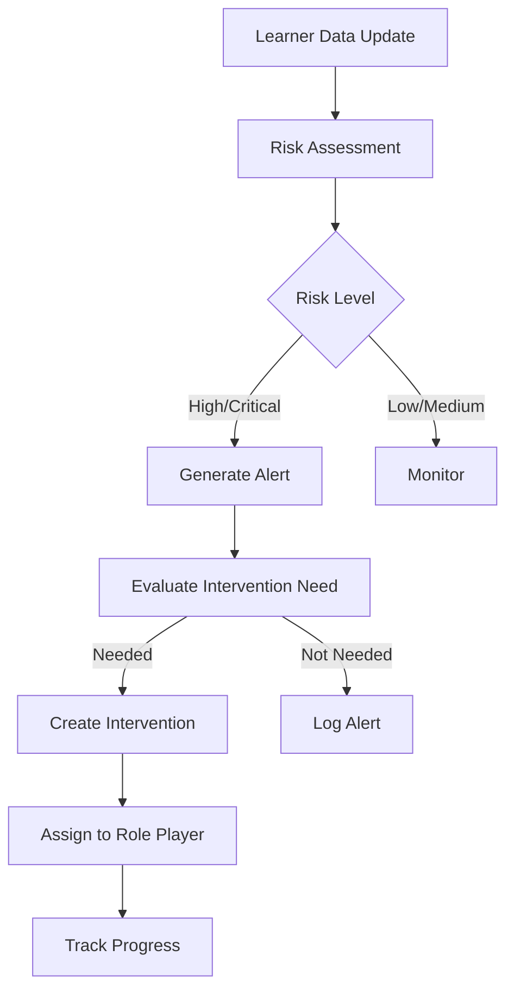

# Integration Workflows Documentation

## Overview

This document describes the automated workflows that connect risk assessment, alert generation, and intervention creation in the iPASS system.

## Workflow: Risk → Alert → Intervention

### Flow Diagram



### Step-by-Step Process

#### 1. Risk Assessment

**Service**: `lib/ai.ts`

```typescript
predictRisk([{ studentId, features: {} }])
```

- Evaluates student risk based on:
  - Attendance rate
  - Academic performance (GPA/APS)
  - Grade level
  - Historical data

**Output**: Risk score (0-100) and risk level (low/medium/high/critical)

#### 2. Alert Generation

**Service**: `lib/alert-service.ts`

```typescript
evaluateRiskAndAlert(studentId)
```

- Checks risk thresholds
- Creates alerts for:
  - Risk increases
  - Low attendance (< 80%)
  - Grade drops (< 50%)
  - Behavioral concerns

**Alert Types**:
- `risk-increase`: Learner risk level increased
- `attendance`: Attendance dropped below threshold
- `grade-drop`: Assessment scores below threshold
- `behavioral`: Behavioral concerns flagged

**Alert Severities**:
- `critical`: Requires immediate attention
- `high`: Needs intervention
- `medium`: Monitor closely
- `low`: Informational

#### 3. Intervention Evaluation

**Service**: `lib/intervention-workflow.ts`

```typescript
evaluateInterventionNeed(studentId, riskFactors)
```

- Determines if intervention is needed based on:
  - Risk level
  - Active risk factors
  - Existing interventions
  - Alert severity

**Decision Logic**:
- High/Critical risk → Intervention needed
- Multiple risk factors → Intervention recommended
- Active alerts → Intervention evaluation required

#### 4. Intervention Creation

**Service**: `lib/intervention-workflow.ts`

```typescript
autoCreateIntervention(alertId, studentId)
```

- Creates intervention with:
  - Type determined by alert type
  - Priority based on severity
  - Assignment to appropriate role player
  - Status: "planned" or "in-progress"

**Intervention Types**:
- `tutoring`: Academic support
- `counseling`: Behavioral/wellness support
- `mentoring`: Peer support
- `academic-support`: General academic assistance

#### 5. Workflow Orchestration

**Service**: `lib/workflow-orchestrator.ts`

```typescript
executeWorkflowForStudent(studentId)
```

- Orchestrates the complete workflow
- Handles error cases
- Tracks execution history
- Provides workflow status

## Event-Driven Architecture

### Event Types

1. **Risk Change Event**
   - Triggered when student risk level changes
   - Handler: `processRiskChange()`

2. **Alert Created Event**
   - Triggered when new alert is created
   - Handler: `processAlertForIntervention()`

3. **Intervention Created Event**
   - Triggered when intervention is created
   - Handler: Track in intervention system

### Batch Processing

```typescript
batchExecuteWorkflow(studentIds[])
```

- Processes multiple students
- Useful for scheduled risk assessments
- Can be run for all at-risk students

## API Endpoints

### Alert Service API

- `getAllAlerts()`: Get all alerts
- `getAlertsByStudent(studentId)`: Get alerts for specific student
- `getAlertsBySeverity(severity)`: Filter alerts by severity
- `triggerAlert(studentId, type, severity, message)`: Create alert programmatically

### Intervention Workflow API

- `autoCreateIntervention(alertId, studentId)`: Create intervention from alert
- `evaluateInterventionNeed(studentId)`: Evaluate if intervention needed
- `assignIntervention(studentId, type, priority)`: Assign intervention
- `processAlertForIntervention(alertId)`: Process alert and create intervention if needed

### Workflow Orchestrator API

- `executeWorkflowForStudent(studentId)`: Execute full workflow for student
- `batchExecuteWorkflow(studentIds[])`: Execute workflow for multiple students
- `executeWorkflowForAtRiskStudents()`: Execute for all at-risk students
- `getWorkflowHistory(studentId?)`: Get workflow execution history

## Error Handling

- Failed risk assessments: Logged, workflow continues with existing data
- Alert creation failures: Logged, retry logic available
- Intervention creation failures: Logged, manual intervention possible
- Workflow partial failures: Status marked as "partial", steps completed are logged

## Monitoring

- Workflow execution history tracked
- Success/failure rates monitored
- Response times measured
- Intervention effectiveness tracked

